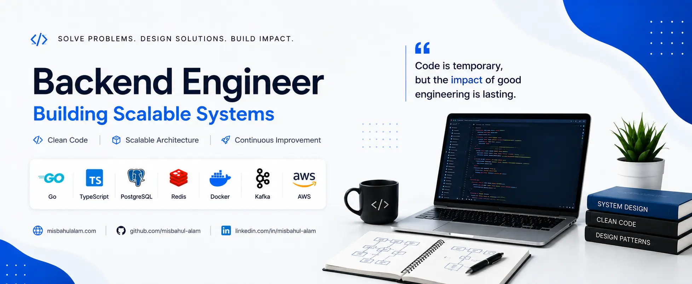

## Hi, I'm Misbahul Alam 👋

 

## 👨‍💻 Professional Summary

I build scalable distributed backend systems that perform well in real production environments. My focus is on clean service boundaries, event-driven architectures and well-designed APIs using REST, GraphQL and gRPC. I pay special attention to the important decisions behind the code. Keeping data consistent, enabling safe communication between services and handling failures gracefully.

I use Domain-Driven Design for clarity and organization in the business logic. I use patterns like Transactional Outbox for reliable messaging and resilience patterns like idempotent consumers, circuit breakers, dead letter queues, smart retries, and so on. I use Kafka and RabbitMQ a lot for background processing.

Data side I use PostgreSQL, MySQL and MongoDB for solid storage and query performance and Redis for practical and high performance caching. I have a strong interest in learning about systems from the ground up, and I always try to build things the right way and not just make them work quickly.
 

## 🚀 Core Expertise

- **Backend Engineering** – Designing and building scalable, production-ready distributed systems with clean architecture
- **Microservices & Event-Driven Systems** – Creating loosely coupled, resilient services that communicate reliably through events
- **API Design** – Developing intuitive APIs using REST, GraphQL, or gRPC based on what the problem actually needs
- **System Design & Architecture** – Applying Domain-Driven Design (DDD), Transactional Outbox, CQRS, and making smart tradeoffs for consistency and availability
- **Messaging & Reliability** – Building robust async pipelines with Kafka and RabbitMQ, including idempotency, circuit breakers, dead letter queues, and smart retry strategies
- **Databases & Caching** – Working with PostgreSQL (optimized queries and indexing), MongoDB, and Redis for high-performance caching tailored to real usage patterns
- **DevOps & Cloud** – Containerization with Docker, orchestration with Kubernetes, AWS cloud services, and smooth CI/CD pipelines
- **Reliability & Maintainability** – Focusing on real failure scenarios, observability, and writing code that stays maintainable over time
   

## 🛠️ Technical Skills

**Languages**  

**Frontend**  

**Backend**  

**APIs & Messaging**  

**Databases**  

**DevOps & Tools**  

**Testing**  

 

## 📊 GitHub Stats

## 📫 Connect With Me

  
  &nbsp;&nbsp;
  
  &nbsp;&nbsp;
  
  &nbsp;&nbsp;
  

